# DevOps Internship Challenge
**Karlo Jagar**

---

## Overview

This repository contains the complete solution for the DevOps Internship Challenge. The project covers provisioning a Linux VM on Azure, containerizing a custom nginx application with Docker, pushing it to Docker Hub, deploying it to an Azure Kubernetes Service (AKS) cluster exposed publicly via the Traefik ingress controller, and defining all infrastructure as code using Terraform.

---

## Challenge Roadmap

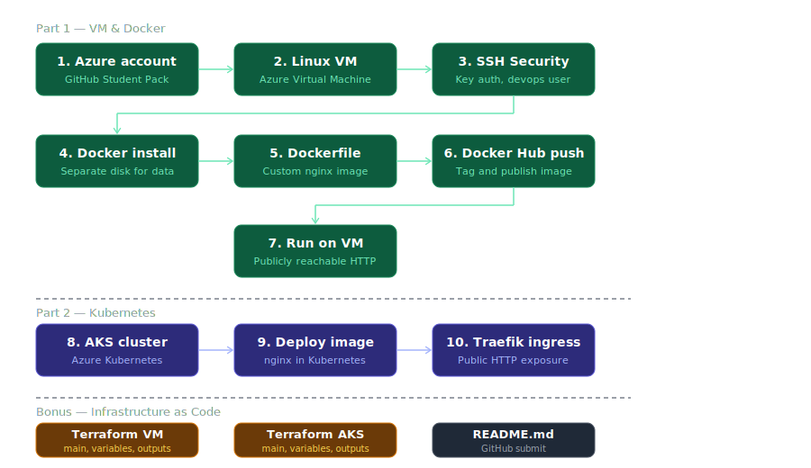

---

## Architecture

```
Internet
    │
    ▼
Azure Load Balancer (9.223.252.236:80)
    │
    ▼
Traefik Ingress Controller  ◄── Ingress rules (path: /)
    │
    ▼
nginx-service (ClusterIP: 10.0.240.125)
    │
    ▼
nginx Pod (karlojagar/moj-nginx:v2)
    │
    ▼
AKS Cluster — devops-aks (Sweden Central, Kubernetes 1.33.7)
```

Separately, the same Docker image runs on a standalone Azure VM:
```
Internet → Azure VM (20.199.137.109:80) → Docker container (nginx)
```

---

## Repository Structure

```
devops-challenge/
├── Dockerfile
├── index.html
├── README.md
├── k8s/
│   ├── deployment.yaml
│   ├── service.yaml
│   └── ingress.yaml
├── terraform/
│   ├── vm/
│   │   ├── main.tf
│   │   ├── variables.tf
│   │   └── outputs.tf
│   └── aks/
│       ├── main.tf
│       ├── variables.tf
│       └── outputs.tf
├── diagrams/
└── screenshots/
```

---

## Part 1 — Virtual Machine & Docker

### Azure VM

A Linux VM was provisioned on Azure with the following specifications:

| Parameter | Value |
|---|---|
| Name | devops-vm |
| Resource group | devops-challenge-rg |
| Region | Switzerland North (Zone 1) |
| OS | Ubuntu Server 24.04 LTS |
| Size | Standard B2ats v2 (2 vCPU, 1 GiB RAM) |
| Public IP | 20.199.137.109 |
| Subscription | Azure for Students |

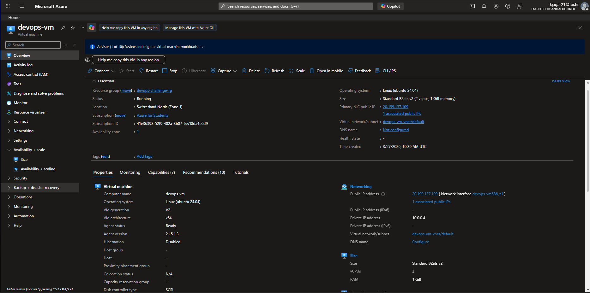

### Virtual Machines vs Containers

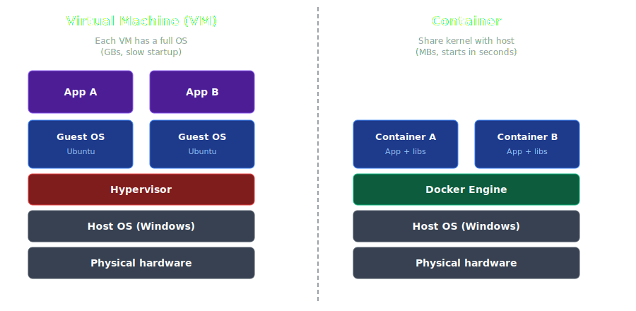

Containers share the host OS kernel and package only what the application needs — making them much smaller and faster to start than full VMs.

### SSH Security

The VM was hardened to use SSH key-based authentication only. Password login was completely disabled by editing `/etc/ssh/sshd_config`:

```
PasswordAuthentication no
PubkeyAuthentication yes
```

A `devops` user was created with SSH key access. The SSH service was restarted to apply the changes:

```bash
sudo systemctl restart ssh
```

### Docker on a Separate Disk

Docker was installed and configured to store all data on a dedicated data disk (`/dev/sdb`, 32 GiB) rather than the OS disk. This is a best practice that prevents Docker data from filling up the OS disk and causing system issues.

```bash
sudo mkfs.ext4 /dev/sdb
sudo mkdir -p /mnt/docker-data
sudo mount /dev/sdb /mnt/docker-data
echo '/dev/sdb /mnt/docker-data ext4 defaults 0 0' | sudo tee -a /etc/fstab
```

Docker was configured to use that disk via `/etc/docker/daemon.json`:

```json
{
  "data-root": "/mnt/docker-data"
}
```

### Custom Nginx Image

```dockerfile
FROM nginx:alpine
COPY index.html /usr/share/nginx/html/index.html
```

`nginx:alpine` was chosen as the base image because it is ~5MB vs ~200MB for the full nginx image.

```bash
docker build -t moj-nginx .
docker tag moj-nginx karlojagar/moj-nginx:v1
docker push karlojagar/moj-nginx:v1
```

Docker Hub: [hub.docker.com/r/karlojagar/moj-nginx](https://hub.docker.com/r/karlojagar/moj-nginx)

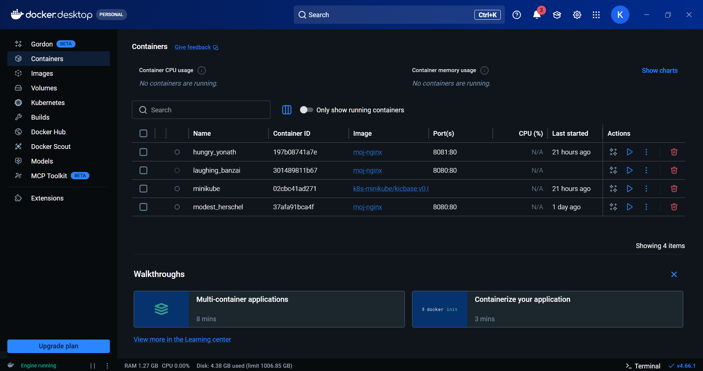

### Running on the VM

```bash
docker run -d -p 80:80 --restart always --name moj-nginx karlojagar/moj-nginx:v2
```

The `--restart always` flag ensures the container starts automatically on VM reboot.

**http://20.199.137.109**

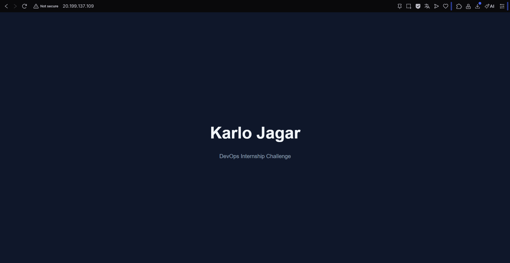

---

## Part 2 — Kubernetes

### Kubernetes Architecture

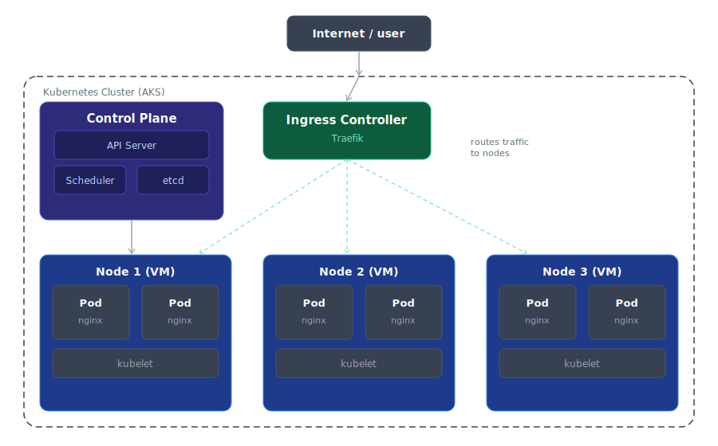

### AKS Cluster

| Parameter | Value |
|---|---|
| Cluster name | devops-aks |
| Region | Sweden Central |
| Kubernetes version | 1.33.7 |
| Node size | Standard_D2s_v3 |
| Node count | 1 |
| Pricing tier | Free |

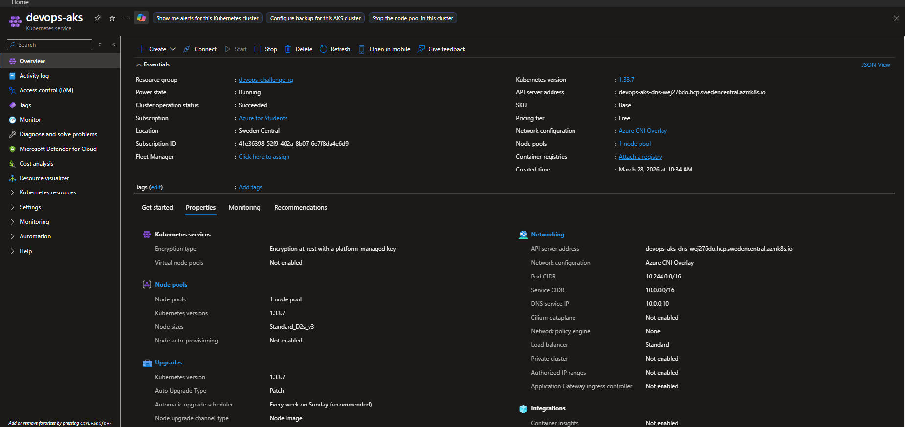

```bash
az aks get-credentials --resource-group devops-challenge-rg --name devops-aks
kubectl get nodes
# NAME                                STATUS   ROLES    AGE   VERSION
# aks-agentpool-29782353-vmss000000   Ready    <none>   4m    v1.33.7
```

### Deploying the Nginx Image

```yaml
# deployment.yaml
apiVersion: apps/v1
kind: Deployment
metadata:
  name: nginx-deployment
spec:
  replicas: 1
  selector:
    matchLabels:
      app: moj-nginx
  template:
    metadata:
      labels:
        app: moj-nginx
    spec:
      containers:
      - name: moj-nginx
        image: karlojagar/moj-nginx:v2
        ports:
        - containerPort: 80
```

```yaml
# service.yaml
apiVersion: v1
kind: Service
metadata:
  name: nginx-service
spec:
  selector:
    app: moj-nginx
  ports:
  - port: 80
    targetPort: 80
  type: ClusterIP
```

### Traefik Ingress Controller

```bash
helm repo add traefik https://traefik.github.io/charts
helm repo update
helm install traefik traefik/traefik --namespace traefik --create-namespace
```

```yaml
# ingress.yaml
apiVersion: networking.k8s.io/v1
kind: Ingress
metadata:
  name: nginx-ingress
  annotations:
    traefik.ingress.kubernetes.io/router.entrypoints: web
spec:
  ingressClassName: traefik
  rules:
  - http:
      paths:
      - path: /
        pathType: Prefix
        backend:
          service:
            name: nginx-service
            port:
              number: 80
```

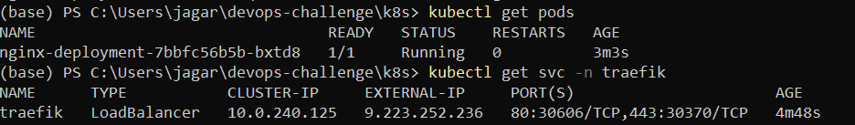

**http://9.223.252.236**

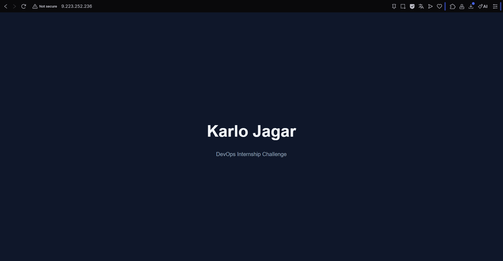

---

## Bonus — Infrastructure as Code (Terraform)

Both the VM and AKS cluster are defined as Terraform code, making the entire infrastructure reproducible from scratch with a single command.

### VM (`terraform/vm/`)

Defines: resource group, virtual network, subnet, public IP, network security group (SSH + HTTP rules), network interface, 32GB data disk, and the Linux VM itself.

```bash
cd terraform/vm
terraform init
terraform plan   # preview — shows all 10 resources that would be created
terraform apply  # provision the infrastructure
```

Key outputs after apply:
```
public_ip_address = "x.x.x.x"
ssh_command       = "ssh -i ~/.ssh/devops-vm-key.pem devops@x.x.x.x"
```

### AKS (`terraform/aks/`)

Defines: resource group and AKS cluster with SystemAssigned identity and Azure CNI Overlay networking.

```bash
cd terraform/aks
terraform init
terraform plan
terraform apply
```

Key outputs after apply:
```
cluster_name     = "devops-aks"
cluster_endpoint = "https://devops-aks-dns-xxx.hcp.swedencentral.azmk8s.io"
```

> **Note:** Terraform code was written and validated with `terraform plan` against real Azure credentials. Since the infrastructure was already provisioned manually beforehand, `terraform apply` was not run to avoid creating duplicate resources.

---

## Key Concepts

### What does an ingress controller do?
An ingress controller is the single entry point for all external HTTP traffic into a Kubernetes cluster. It reads Ingress rules and routes requests to the correct internal service — for example, `/api` to a backend and `/` to a frontend — all through one public IP address. Without it, every service would need its own public IP.

### What is Traefik's role?
Traefik is a concrete implementation of an ingress controller. Kubernetes defines the ingress concept but does not ship a router. Traefik handles the actual routing and automatically discovers new services in the cluster without manual reconfiguration.

### How does traffic get from the internet to the container?

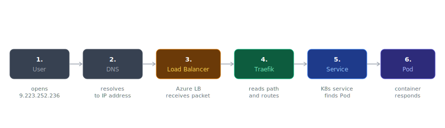

1. User opens `9.223.252.236` in browser
2. Azure Load Balancer receives the request (only component with a public IP)
3. Traefik reads the path and routes according to Ingress rules
4. Kubernetes ClusterIP Service finds the correct Pod
5. nginx container responds

### What is load balancing?
Distributing incoming requests across multiple instances so no single Pod gets overwhelmed. If a Pod crashes, traffic is automatically redirected to healthy ones. In this setup Azure handles it at the infrastructure level (Load Balancer) and Kubernetes handles it at the application level (Service).

### ClusterIP vs NodePort vs LoadBalancer

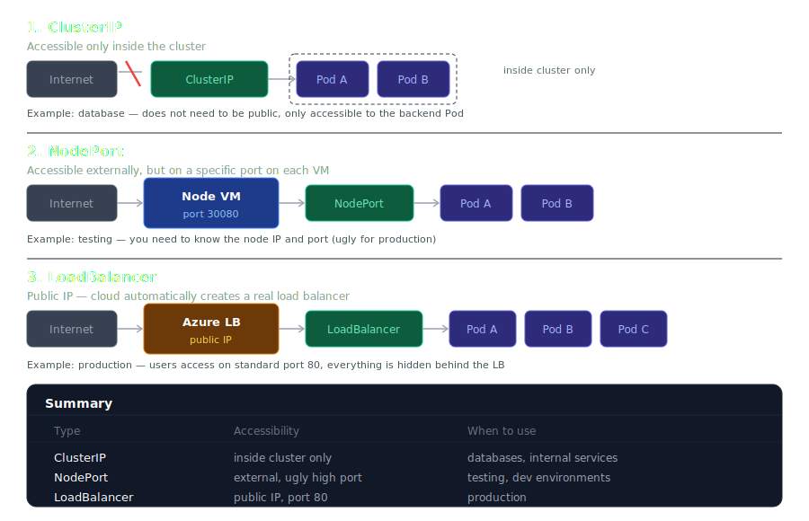

In this project: `nginx-service` uses **ClusterIP** (internal), `traefik` uses **LoadBalancer** (public-facing, gets a real Azure IP).

---

## Problems & Solutions

| Problem | What happened | How it was solved |
|---|---|---|
| Azure Student subscription had 0 vCPU quota in every region | Tried West Europe, North Europe, East US — all returned quota errors when creating the AKS node pool | Systematically tried every available region; Sweden Central had quota available for Standard_D2s_v3 |
| West Europe did not support VM creation on student account | Got "Your subscription doesn't support virtual machine creation in West Europe" after filling out the entire VM form | Switched to Switzerland North which worked |
| Azure portal image dropdown only showed Windows Server images | Landed on the "Free account virtual machine" wizard which has a limited marketplace | Navigated to "Virtual machines" directly and used the full Create flow with access to the complete image marketplace |
| AKS node pool rejected all B-series VM sizes | B-series VMs cannot be scheduled in AKS node pools | Switched to D-series (Standard_D2s_v3) which is supported |
| Port 80 was blocked after container was running | Azure Network Security Group denies all inbound traffic by default — no rule for HTTP existed | Added an inbound security rule for TCP port 80 in the VM's NSG through the Azure portal |
| Terraform could not read the SSH public key file | Only the `.pem` private key was available locally, no `.pub` file | Generated the public key from the private key using `ssh-keygen -y -f devops-vm-key.pem` and embedded it directly in `main.tf` |

---

## How to Run Locally

```bash
# Clone the repository
git clone https://github.com/kjagar21/devops-challenge
cd devops-challenge

# Build and run with Docker
docker build -t moj-nginx .
docker run -d -p 8080:80 moj-nginx
# Open http://localhost:8080

# Deploy to Kubernetes locally with minikube
minikube start --driver=docker
kubectl apply -f k8s/
minikube tunnel
# Open http://127.0.0.1
```

---

## Live URLs

| Environment | URL |
|---|---|
| Azure VM (Docker) | http://20.199.137.109 |
| AKS + Traefik (Kubernetes) | http://9.223.252.236 |
| Docker Hub | https://hub.docker.com/r/karlojagar/moj-nginx |